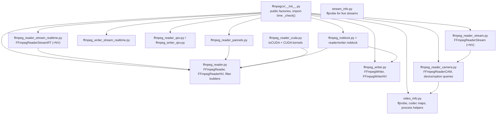

# Architecture

How ffmpegcv is put together, so an agent can predict behavior and change it safely.

## 1. Module map



`__init__.py` performs one side effect at import: `_check()` verifies `ffmpeg` and `ffprobe`
exist on `PATH` and raises `RuntimeError` if not.

## 2. Core mechanism: raw frames over a pipe

Every reader launches one `ffmpeg` child and reads fixed-size raw frames from its stdout:

```
ffmpeg [...input/flags...] -pix_fmt <pix_fmt> -f rawvideo pipe:
```

`out_numpy_shape` (from `get_outnumpyshape`) determines the bytes-per-frame =
`np.prod(out_numpy_shape)`. `read()` does `process.stdout.read(nbytes)`; a short/empty read
means EOF → `release()` and `(False, None)`.

Writers invert it:

```
ffmpeg -y -f rawvideo -pix_fmt <in_fmt> -s <w>x<h> -r <fps> -i pipe: ... "{filename}"
```

`write()` serializes the array with `.astype(np.uint8).tobytes()` and pushes it to
`process.stdin`. The output size is locked to the **first** frame's shape.

## 3. Exact command templates

| Reader | Command (abridged, from source) |
| ------ | ------------------------------- |
| `VideoCapture` | `ffmpeg -loglevel error {infile_options} -vcodec {codec} -r {fps} -i "{file}" {filteropt} -pix_fmt {pix_fmt} -r {fps} -f rawvideo pipe:` |
| `VideoCaptureNV` | `ffmpeg -loglevel error -hwaccel cuda -hwaccel_device {gpu} {infile_options} -vcodec {codec_cuvid} {cropopt} {scaleopt} -r {fps} -i "{file}" {filteropt} -pix_fmt {pix_fmt} -r {fps} -f rawvideo pipe:` |
| `VideoCaptureQSV` | `ffmpeg -loglevel warning {infile_options} -vcodec {codec_qsv} -r {fps} -i "{file}" {filteropt} -pix_fmt {pix_fmt} -r {fps} -f rawvideo pipe:` |
| `VideoCaptureCAM` | `ffmpeg -loglevel warning -f {dshow\|v4l2\|avfoundation} -video_size {W}x{H} {framerate} {camcodec} {campix_fmt} -i {camname} {filteropt} -pix_fmt {pix_fmt} -f rawvideo pipe:` |
| `VideoCaptureStream` | `ffmpeg -loglevel warning {infile_options} {rtsp_opt} -vcodec {codec} -i {url} {filteropt} -pix_fmt {pix_fmt} -f rawvideo pipe:` |
| `VideoCaptureStreamRT` | `ffmpeg -loglevel error {infile_options} {rtsp_opt} -fflags nobuffer -flags low_delay -strict experimental -vcodec {codec} -i {url} {filteropt} -pix_fmt {pix_fmt} -f rawvideo pipe:` |
| `VideoCapturePannels` | `ffmpeg -loglevel warning -r {fps} -i "{file}" -filter_complex "split=N[VSRC0]...;[VSRC0]crop=...[VPANEL0];..." -map [VPANEL0] -pix_fmt {pix_fmt} -r {fps} -f rawvideo pipe: -map ...` |

| Writer | Command |
| ------ | ------- |
| `VideoWriter` | `ffmpeg -y -loglevel error -f rawvideo -pix_fmt {in} -s {w}x{h} -r {fps} -i pipe: {bitrate} -r {fps} -c:v {codec} {preset} {scale} {rtsp} -pix_fmt {out} "{file}"` |
| `VideoWriterNV` | same, plus `-gpu {gpu}`, default codec `hevc_nvenc`, out fmt `yuv420p` |
| `VideoWriterStreamRT` | `ffmpeg -loglevel warning -f rawvideo -pix_fmt {in} -s {w}x{h} -i pipe: {bitrate} -f flv -rtsp_transport tcp -tune zerolatency -preset ultrafast {scale} {rtsp} -c:v {codec} -g 50 -pix_fmt yuv420p "{url}"` |

Commands are built as plain strings but executed with `shell=False` after `shlex.split`
(`video_info.run_async` / `run_async_reader` / `release_process*`). Cropping/filter values are
therefore unquoted tokens; file paths stay wrapped in `"..."`.

## 4. Filter construction

`get_videofilter_cpu(originsize, pix_fmt, crop, resize, keepratio, align)` returns
`(crop_wh, final_wh, filteropt)`:

- crop → `crop=W:H:X:Y`
- resize (stretch) → `scale=WxH`
- resize (keep ratio) → `scale=reWxreH,pad=W:H:X:Y:black`
- `gray` → append `extractplanes=y`
- all joined with commas and emitted as `-vf a,b,c`

`get_videofilter_gpu(...)` returns `(crop_wh, final_wh, (cropopt, scaleopt, filteropt))` and
uses cuvid decoder options instead: `-crop top x bottom x left x right` and `-resize WxH` are
placed **before `-i`**; only padding uses a `-vf pad=...` filter. This is why the NV path can
require even crop coordinates while the CPU path silently floors odd ones.

Even-number constraints are enforced asymmetrically:

| Path | Behavior on odd values |
| ---- | ---------------------- |
| CPU crop | floored to even, prints `Warning 'crop_xywh' would be replaced into even numbers` |
| resize (CPU + GPU) | `assert ... 'resize' must be even number` |
| NV crop | `assert all(n % 2 == 0 ...)` |
| `yuv420p`/`nv12` output | shape asserts height is even |

## 5. Concurrency & process model

| Component | Model |
| --------- | ----- |
| `FFmpegReader` (file / RT) | 1 ffmpeg child; blocking `stdout.read`; no threads |
| `VideoCaptureCAM`, `VideoCaptureStream` | 1 ffmpeg child + `ProducerThread` → `Queue(maxsize=30)`; the thread calls `read_()` and drops the oldest frame when full |
| `ReadLiveLast` | 1 reader + `threading.Thread` keeping only the newest frame (`Queue(maxsize=1)`) |
| `noblock` reader | `multiprocessing.Process` child + shared `Array(NFRAME * frame_bytes)`, `Queue(maxsize=NFRAME-2)` |
| `noblock` writer | `multiprocessing.Process` child + shared `Array`, parent `write()` copies into a slot and sends its index |

Because the `noblock` workers are `multiprocessing` processes, the calling code must be
spawn-safe on macOS/Windows (module-level entry point guarded by `if __name__ == "__main__":`).
| Writers | 1 ffmpeg child; `write()` also `select()`s stderr every frame and forwards any pending output |

Objects are **not thread-safe**: call `read()`/`write()` from a single thread only.
`__len__` always comes from ffprobe metadata; `noblock`/`ReadLiveLast` copy it from the
wrapped reader. `VideoCapturePannels` inherits `__len__` from `FFmpegReader`, but camera
readers (`FFmpegReaderCAM` and `VideoCaptureStream`, which extends it) define none.

## 6. Metadata & codec mapping

- File metadata: `video_info.get_info` runs `ffprobe -show_streams` (with `-count_packets` for
  `mkv`, `flv`, `ts`, and as a fallback when `nb_frames` is absent). `get_info_precise` probes
  first/last pts times to compute an exact fps.
- Stream metadata: `stream_info.get_info` adds `-analyzeduration` and prefers `avg_frame_rate`.
- Device counts: `get_num_NVIDIA_GPUs()` parses `ffmpeg ... -gpu list` stderr;
  `get_num_QSV_GPUs()` checks `ffmpeg -f qsv -h encoder=h264_qsv` and explicitly rejects the
  `"not recognized"` message emitted by newer ffmpeg. Both memoize globally.
- Codec maps live in `video_info`: `h264→h264_nvenc`, `hevc→hevc_nvenc`, decoder
  `h264/x264→h264_cuvid`, etc. Unknown names raise a plain `Exception`.

## 7. CUDA path (`toCUDA`)

`ffmpeg_reader_cuda.py` embeds four CUDA kernels (YUV420p/NV12 × CHW/HWC) that convert
YUV → RGB float32 on the device. `FFmpegReaderCUDA` wraps an existing reader (whose
`pix_fmt` must be `yuv420p` or `nv12`), creates a `PycudaContext`, and exposes
`read()` / `read_cudamem()` / `read_torch()`. `torch` is imported lazily; `pycuda` is imported
at module import and is therefore only needed if you actually call `toCUDA`.

## 8. Where bugs usually live

- Filter string assembly (CPU vs GPU asymmetry) — `ffmpeg_reader.py`.
- Frame-size math for planar formats — `get_outnumpyshape` and the writers' first-frame logic.
- Process lifetime: early returns before `release()`, camera/stream producer threads that
  outlive their reader.
- `shlex.split` on unquoted paths / values containing spaces.
- Platform branches in `ffmpeg_reader_camera.py` (`this_os`, per-platform flag names).
